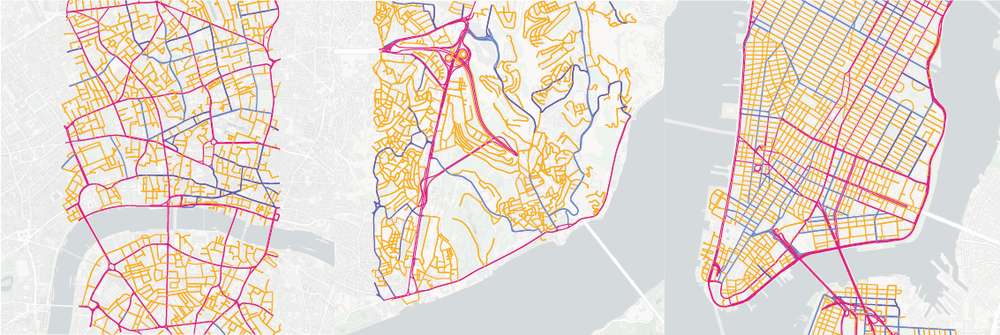

    

# Data-Driven Modeling of Traffic Flow in Macroscopic Network Systems
### Abstract
Urban traffic modeling is essential for understanding and mitigating congestion, yet existing approaches face a trade-off between realism and scalability. Microscopic agent-based simulators capture individual vehicle behavior but are computationally intensive and hard to calibrate at scale. Macroscopic models, while more efficient, often rely on strong assumptions, such as fixed origin–destination flows, or oversimplify network dynamics. In this work, we propose a data-driven macroscopic model that simulates traffic as a discrete-time load-exchange process over flow networks. The model captures key phenomena such as bottlenecks, spillbacks, and adaptive load redistribution using only road-type attributes, network structure, and observed traffic density. Parameter learning is performed via evolutionary optimization, allowing the model to adapt to both synthetic and real-world conditions without assuming latent travel demand. We evaluate the framework on synthetic grid-like networks and on real traffic data from London, Istanbul, and New York. The resulting framework provides a scalable and interpretable alternative for urban traffic forecasting, balancing predictive accuracy with computational efficiency across diverse network conditions.